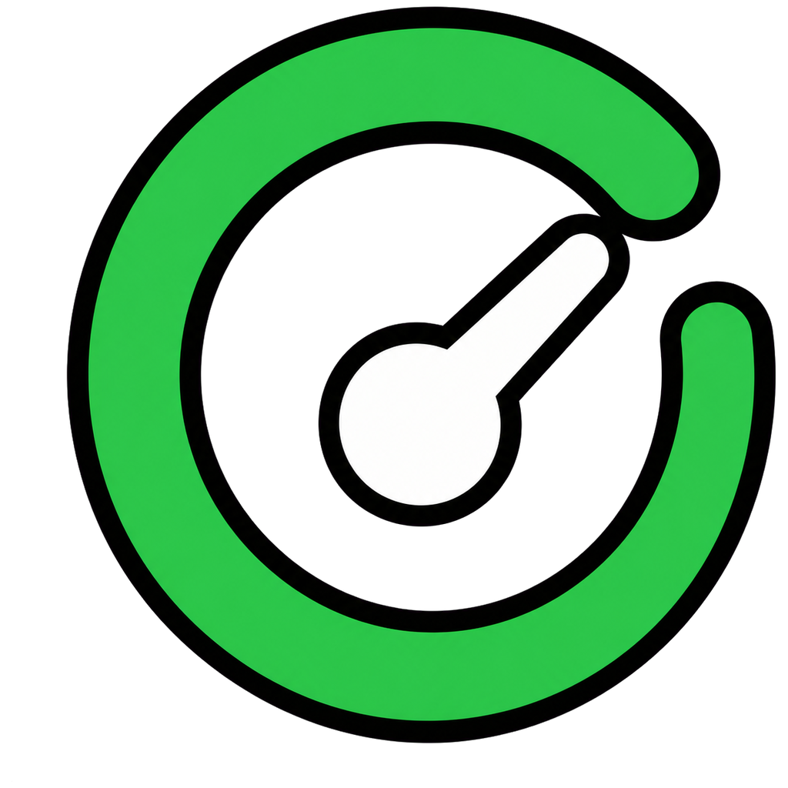

# Codex Local Quota Dashboard

<p align="center">
  
</p>

一个面向 Windows 的轻量桌面仪表盘，只读取本机 Codex 会话日志，显示最近缓存的额度快照和本地 Token 使用统计。程序不调用在线额度接口，也不会上传会话内容。

## 功能特点

- **完全本地读取**：扫描 `%USERPROFILE%\.codex\sessions` 和 `archived_sessions`。
- **额度快照**：显示本地日志中最近记录的额度剩余百分比和重置时间。
- **用量统计**：汇总今日、近 7 天、近 30 天的输入、输出和缓存 Token。
- **桌面仪表盘**：无标题栏的紧凑窗口，支持拖动、四边缩放和整体等比缩放。
- **Codex 顶部横条**：自动贴附到 Codex 窗口顶部，只在 Codex 位于前台时显示。
- **三种外观**：深色、浅色和透明模式，可在仪表盘与顶部横条之间同步切换。
- **托盘常驻**：支持托盘菜单、窗口置顶、隐藏和开机启动。
- **高 DPI 支持**：针对 Windows 缩放和小尺寸托盘图标进行优化。
- **单实例运行**：重复启动会唤醒现有窗口，不会创建多个实例。

## 隐私与数据来源

应用只读取本机 Codex 已生成的 JSONL 会话日志，不会发起网络请求。它不会读取或显示提示词正文，只解析本地日志里的 Token 计数与限额快照字段。

> [!IMPORTANT]
> 显示的额度是 Codex 最近一次写入本地日志的缓存快照，并非 OpenAI 服务端的实时额度。若近期没有产生新的 Codex 日志，数据可能暂时滞后。

## 系统要求

- Windows 10 或 Windows 11
- .NET Framework 4.8
- 已使用过 Codex，并存在本地 `.codex` 会话日志

## 安装与使用

1. 从 [Releases](https://github.com/yangyangha1/codex-local-quota-dashboard/releases/latest) 获取 `CodexLocalQuotaDashboard-v1.0.0.exe`。
2. 将程序放到任意目录并直接运行，无需安装。
3. 在仪表盘任意位置点击右键，可切换显示模式、外观、置顶和开机启动。
4. 拖动仪表盘内容可移动窗口；拖动窗口边缘或四角可整体缩放。

## 从源码编译

使用 Visual Studio 2022 或已安装 .NET Framework 4.8 SDK 的命令行环境：

```powershell
msbuild CodexLocalDashboard.csproj /p:Configuration=Release
```

也可以直接使用 .NET Framework C# 编译器：

```powershell
& "$env:WINDIR\Microsoft.NET\Framework64\v4.0.30319\csc.exe" `
  /nologo /target:winexe /optimize+ /win32icon:dashboard.ico `
  /out:CodexLocalDashboard.exe `
  /reference:System.dll /reference:System.Core.dll `
  /reference:System.Drawing.dll /reference:System.Windows.Forms.dll `
  /reference:Microsoft.CSharp.dll Program.Framework.cs
```

## 已知限制

- 无法在离线状态下得知服务端实时剩余额度，只能展示最近的本地缓存快照。
- 本地统计取决于 Codex 日志格式；如果未来日志结构发生变化，可能需要更新解析规则。
- 顶部横条模式依赖 Windows 上可识别的 Codex 桌面窗口。

## 项目名称

中文：**Codex 额度仪表盘 - 本地识别**  
英文：**Codex Local Quota Dashboard**

## License

本项目使用 [MIT License](LICENSE)。本项目为非官方社区工具，与 OpenAI 无隶属或背书关系。
