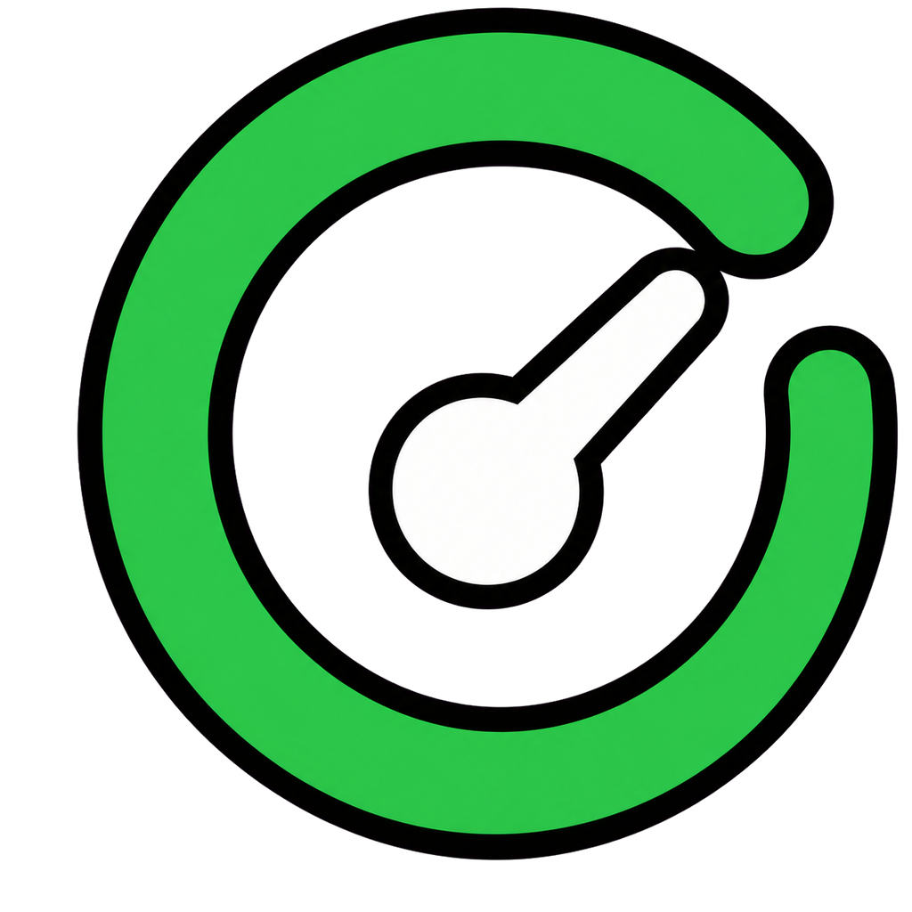
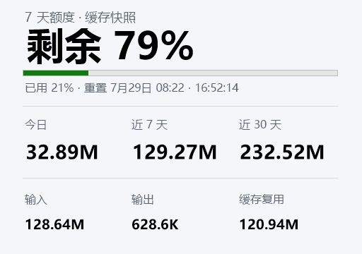
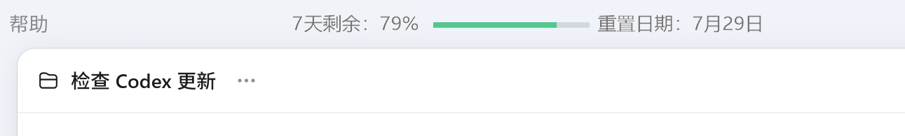

# Codex Local Quota Dashboard

<p align="center">
  
</p>

一个面向 Windows 的 Codex 额度与 Token 用量仪表盘，并提供同一功能逻辑的原生 macOS 悬浮面板。两版都只读取本机 Codex 日志：不需要账号、API Key 或网络访问，也不会上传提示词、会话内容或用量数据。

> [!NOTE]
> macOS 原生实现位于 [`macOS/`](macOS/README.md)。它是独立、可移动和可缩放的桌面悬浮面板；原 Windows 的 Codex 顶部横条/窗口贴附模式不会在 macOS 上出现。

## 快速使用

### Windows

1. 获取 `CodexLocalDashboard-v1.5.5.exe`。
2. 双击运行，程序会自动扫描 `%USERPROFILE%\\.codex\\sessions` 和 `archived_sessions`，无需安装和登录。
3. 仪表盘会显示最近的本地额度快照，以及今日、近 7 天和近 30 天 Token 用量。
4. 左键点击托盘图标可直接显示缓存快照仪表盘；在仪表盘任意位置点击右键，可调整主题、透明度、置顶和隐藏。

### macOS 14 或更新版本

1. 在 [v1.5.5 Release](https://github.com/yangyangha1/codex-local-quota-dashboard/releases/tag/v1.5.5) 下载 `CodexQuotaWidget-macOS-v1.5.5.zip`。
2. 解压后将 `CodexQuotaWidget.app` 拖入“应用程序”文件夹，或保留在任意本地目录后双击运行。
3. 当前公开包**没有 Apple Developer ID 签名或公证**。首次启动被系统拦截时，在 Finder 中按住 Control 点击 App，选择“打开”并在确认框中再次选择“打开”；也可前往“系统设置 → 隐私与安全性”选择“仍要打开”。
4. 菜单栏额度图标左键可查看当前额度摘要，右键可设置主题、透明度、置顶、隐藏与开机自动启动。实时页面除“历史／明细”按钮外的任意位置均可拖动面板；只有历史图表支持框选放大。

如 macOS 仍因下载隔离而拒绝打开，请先确认 Release 页面中的 SHA-256 与下载包一致，再执行：

```zsh
xattr -dr com.apple.quarantine /Applications/CodexQuotaWidget.app
```

macOS 下载包只包含可执行的 `.app`，不包含源码、安装器、系统小组件扩展或顶部横条功能。更完整的说明见 [`macOS/README.md`](macOS/README.md)。

## 从源码构建 macOS 版

需要 macOS 14 或更新版本，以及 Apple Command Line Tools。无需 .NET。

```zsh
cd macOS
./scripts/build-app.sh
open CodexQuotaWidget.app
```

构建脚本会生成同时支持 Apple Silicon 和 Intel Mac 的通用 `.app`。发布 ZIP 可由下列脚本生成：

```zsh
cd macOS
./scripts/package-release.sh
```

## 界面预览

**桌面仪表盘**

<p align="center">
  
</p>

**Codex 顶部横条（仅 Windows）**

<p align="center">
  
</p>

## 功能特点

- **完全本地读取**：扫描本机 `.codex/sessions` 和 `archived_sessions`；不会联网或上传数据。
- **额度快照**：显示本地日志中最近记录的额度剩余百分比和重置时间；该值不是服务端实时查询结果。
- **用量统计和图表**：汇总今日、近 7 天、近 30 天 Token；保留实时额度、速率和累计 Token 图表及 1h～48h 时间轴。
- **本地历史数据**：每 30 秒缓冲一个隐私最小化的数据点，每 5 分钟批量写入；兼容 96 字节历史格式并在超过 8 MB 后分级压缩。
- **按需项目明细**：仅在打开明细时读取项目、会话、模型、Token 构成和工具调用；普通界面不常驻这些对象。
- **原生 macOS 悬浮面板**：无标题、可拖动、等比缩放、可置顶；历史页面可框选时间段放大。它不含系统 WidgetKit 扩展，也不贴附 Codex 窗口。
- **Windows 桌面仪表盘**：无标题栏、支持拖动、四边缩放、托盘常驻与可选顶部横条。

## 隐私与数据来源

应用只读取本机 Codex 已生成的 JSONL 会话日志，不会发起网络请求。它不会读取或显示提示词正文，只解析本地日志里的 Token 计数与限额快照字段。

> [!IMPORTANT]
> 显示的额度是 Codex 最近一次写入本地日志的缓存快照，并非 OpenAI 服务端的实时额度。若近期没有产生新的 Codex 日志，数据可能暂时滞后。

## 系统要求

- Windows 10 或 Windows 11：.NET Framework 4.8
- macOS 14 或更新版本：下载版无需开发工具；从源码构建需要 Apple Command Line Tools
- 已使用过 Codex，并存在本地 `.codex` 会话日志

## 从源码编译 Windows 版

使用 Visual Studio 2022 或已安装 .NET Framework 4.8 SDK 的命令行环境：

```powershell
msbuild CodexLocalDashboard.csproj /p:Configuration=Release
```

也可以直接使用 .NET Framework C# 编译器：

```powershell
& "$env:WINDIR\\Microsoft.NET\\Framework64\\v4.0.30319\\csc.exe" `
  /nologo /target:winexe /optimize+ /win32icon:dashboard.ico `
  /out:CodexLocalDashboard.exe `
  /reference:System.dll /reference:System.Core.dll `
  /reference:System.Drawing.dll /reference:System.Windows.Forms.dll `
  /reference:Microsoft.CSharp.dll /reference:System.Web.Extensions.dll `
  Program.Framework.cs TokenRateChart.cs ProjectDetail.cs `
  HistoryStore.cs HistoryDashboard.cs
```

## 已知限制

- 无法在离线状态下得知服务端实时剩余额度，只能展示最近的本地缓存快照。
- 本地统计取决于 Codex 日志格式；如果未来日志结构发生变化，可能需要更新解析规则。
- macOS 发布包未经 Apple Developer ID 签名或公证；首次运行需按上述方式在系统安全提示中确认。

## License

本项目使用 [MIT License](LICENSE)。本项目为非官方社区工具，与 OpenAI 无隶属或背书关系。
